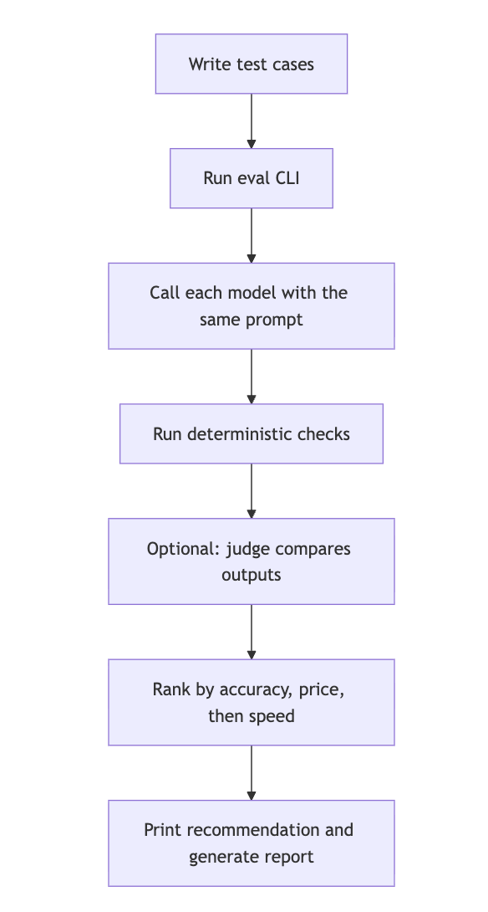

# LLM Eval Harness

A runnable OpenRouter-based evaluation harness for comparing LLMs on your own product workflows.

It runs the same test cases across multiple candidate models, scores objective requirements with deterministic checks, optionally asks a judge model to compare responses, and writes Markdown/JSON reports with cost and latency.

## Workflow



## Why Use This

Generic benchmarks rarely match production behavior. Real applications care about things like:

- Did the model return valid JSON?
- Did it choose the right action?
- Did it avoid inventing facts?
- Did it follow the schema and length limits?
- How expensive was the result?
- How long did it take?
- Did the provider fail or timeout?

This harness is meant for practical model selection, not leaderboard chasing.

## Install

Requirements:

- Node.js 20+
- An OpenRouter API key

```bash
git clone git@github.com:magicsword-io/llm-eval-harness.git
cd llm-eval-harness
npm install
cp .env.example .env
```

Then edit `.env` or export the key in your shell:

```bash
export OPENROUTER_API_KEY=sk-or-your-key
```

The CLI reads `OPENROUTER_API_KEY` from the environment. It does not need a browser or framework.

## Quick Start

Run two models against the included generic examples:

```bash
npm run eval -- \
  --model google/gemini-3.1-flash-lite-preview \
  --model x-ai/grok-4.1-fast \
  --out reports/smoke.md \
  --json reports/smoke.json
```

Run with a judge model:

```bash
npm run eval -- \
  --model google/gemini-3.1-flash-lite-preview \
  --model google/gemini-3-flash-preview \
  --model x-ai/grok-4.1-fast \
  --judge openai/gpt-5.4-mini \
  --timeout-seconds 60 \
  --judge-timeout-seconds 120 \
  --out reports/judged.md \
  --json reports/judged.json
```

Run a quick smoke test:

```bash
npm run smoke
```

## Example Output

See [docs/example-report.md](docs/example-report.md) for a shortened example report.

Generated reports include:

- Recommended model
- Deterministic score by model
- Judge accuracy and overall score
- Judge win count
- Token usage
- Estimated cost
- Cost per case
- Average latency
- API errors
- JSON parse failures
- Per-case details

The CLI also prints the recommended model and short reason at the end of each run.

## CLI Flags

| Flag | Purpose |
|---|---|
| `--model <id>` | Candidate model. Repeat for multiple models. |
| `--judge <id>` | Optional judge model that compares all candidate responses per case. |
| `--cases <dir>` | Cases directory. Defaults to `examples/cases`. |
| `--category <name>` | Run one category. |
| `--case <id>` | Run one case by ID. |
| `--limit <n>` | Run the first N matching cases. |
| `--timeout-seconds <n>` | Candidate timeout. Default: 60. |
| `--judge-timeout-seconds <n>` | Judge timeout. Default: 120. |
| `--sequential` | Run candidate models one at a time. Default is parallel per case. |
| `--out <path>` | Markdown report path. Default: `reports/report.md`. |
| `--json <path>` | Optional raw JSON report path. |

## How Scoring Works

The harness uses two scoring layers.

### Deterministic Checks

Each case can define checks for objective requirements:

- `json_path_equals`
- `json_path_in`
- `string_contains_any`
- `string_contains_all`
- `string_excludes`
- `array_min_length`
- `array_max_length`
- `max_chars`
- `json_path_truthy`

These checks are cheap, repeatable, and should catch anything that does not require judgment.

### LLM-as-Judge

If `--judge` is provided, the judge sees the case prompt, gold notes, rubric, and all candidate responses. It returns JSON with per-model ratings:

- `accuracy`
- `format_adherence`
- `specificity`
- `safety`
- `overall`

The judge also picks the best response and names hallucinations or risky behavior.

The judge is useful, but it is not the final word. For important model changes, compare results from more than one judge and inspect the per-case report.

## Recommendation Logic

The default ranking priority is:

1. Accuracy
2. Pricing
3. Speed

Models within `0.25` judge-accuracy points are treated as accuracy-tied, so lower cost can decide. Latency decides after cost.

If no judge is used, deterministic score is used as the accuracy signal.

## Case Format

Cases live in `examples/cases/*.json`. Each file can contain one case or an array of cases.

For a full guide, see [docs/writing-cases.md](docs/writing-cases.md).

```json
{
  "id": "triage-001-clear-credential-theft",
  "category": "security-triage",
  "description": "Clear credential-theft behavior should be denied.",
  "system": "Return only JSON with this shape: ...",
  "input": "Event details go here.",
  "checks": [
    { "kind": "json_path_equals", "path": "decision", "value": "deny", "weight": 3 },
    { "kind": "json_path_in", "path": "severity", "any_of": ["high", "critical"], "weight": 2 }
  ],
  "gold_notes": "What a strong response should notice.",
  "judge_rubric": "What the judge should penalize or reward."
}
```

When `checks` are present, the runner requests OpenRouter JSON mode. Put the word `JSON` in your system prompt because some providers require it when JSON mode is enabled.

## Suggested Workflow

1. Start with 3 to 5 realistic cases from one workflow.
2. Add deterministic checks for schema, decisions, and factual traps.
3. Run cheap smoke tests without a judge.
4. Add a judge only when comparing finalists.
5. Save the raw JSON report so other reviewers can inspect it without rerunning the eval.
6. Promote a model only after checking accuracy, cost, latency, parse failures, and provider errors.

## Notes

- OpenRouter model IDs and pricing change over time. The runner fetches live pricing from OpenRouter when available and falls back to a small local table.
- Judge calls can dominate cost because every candidate response is sent back to the judge.
- Provider errors count as eval data. A high-quality model that fails often may still be a poor production default.
- The included cases are examples only. Replace them with cases that reflect your product.
